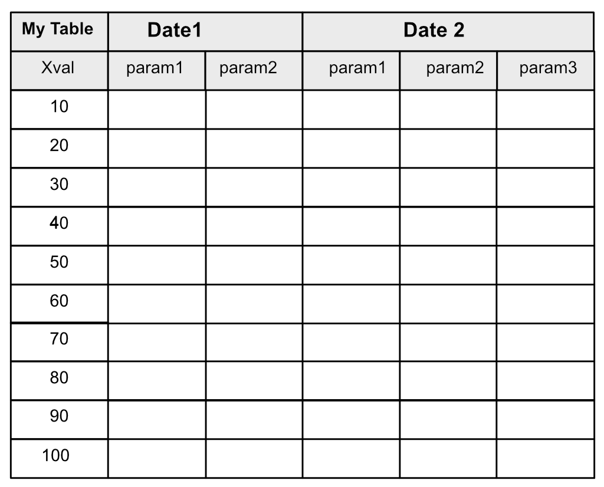

## Requirements for the CustomHeader for QTableWidget

**Overview**

- The overall goal is to have a custom header for labelling hierarchical data that is presented in a table. See the image below.
- At the top level, the label spans several columns. Underneath a top-level label are one or more sub labels, typically for parameters inside a data set.
- Must be familiar with git and github. Work is to be delivered into a dev branch on github.

<!-- 
 -->
 

**Requirements**

- The code should be created in hierarchicalqheader.py, class should be in class CustomHeader.
- Must work on PySide6, PySide2, PyQt5
- Labels must be stylable using QStyleSheet commands.
- Data sets are defined typically as dictionary.See the example python file.
- See main() in hierarchicalqheader.py for typical data and an interface.
- Data sets do not need to be reorganized using drag and drop.
- There should be no nasty side effects. e.g. Resizing the columns should be possible, sorting based on a column should still be possible.

